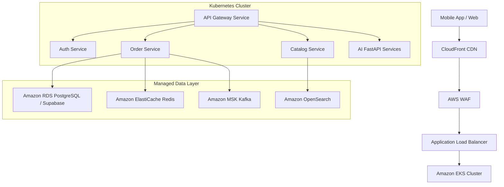

# QuickBite Deployment Architecture

## 1. High-Level Architecture Overview

QuickBite utilizes a multi-region, cloud-native architecture deployed primarily on AWS using Kubernetes (EKS).

## 2. CI/CD Pipeline (GitHub Actions)

We use GitHub Actions for continuous integration and delivery.

1. **Commit & PR**: Code is linted, unit tested (`jest`), and sonar-scanned.
2. **Merge to Main**: 
   - Docker images are built and tagged with the Git SHA.
   - Images are pushed to Amazon ECR.
3. **Deployment (ArgoCD)**:
   - ArgoCD detects the new image tag in the deployment manifest repo.
   - ArgoCD syncs the EKS cluster to the desired state (GitOps).

## 3. Database Migration Strategy
- Migrations are managed via Prisma ORM CLI inside the CI/CD pipeline.
- For structural changes, `prisma migrate deploy` is run as a Kubernetes Job before the updated application pods roll out.

## 4. Scalability & Availability
- **HPA (Horizontal Pod Autoscaler)**: Scales pods based on CPU/Memory and custom metrics (e.g., Kafka lag).
- **Multi-AZ**: RDS and EKS Node Groups are spread across 3 Availability Zones.
- **Circuit Breakers**: Implemented at the API Gateway using `@nestjs/axios` interceptors to prevent cascading failures.

## 5. Observability (Prometheus, Grafana, Datadog)
- **Tracing**: OpenTelemetry auto-instrumentation spans every request from API Gateway -> Internal Service -> Database.
- **Metrics**: Exported to Prometheus.
- **Logs**: Fluend ships stdout logs to OpenSearch for Centralized Logging.
